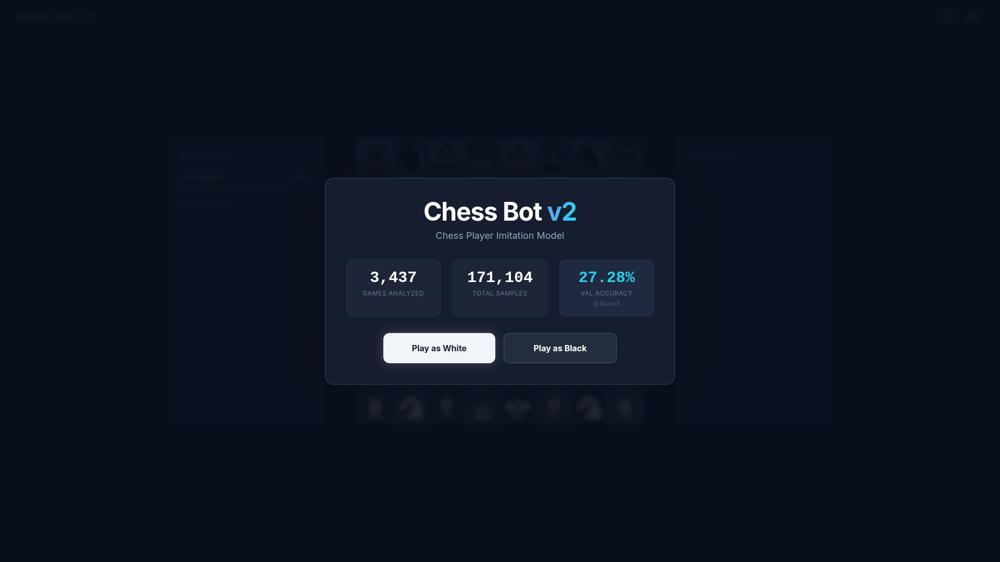
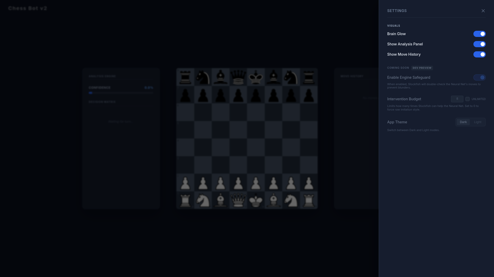

# The Imitation Engine: Neural Chess Clone (v2.0)


> **"I trained a neural network to play exactly like me—blunders included."**

A hybrid chess engine that combines deep learning (behavioral cloning) with algorithmic safety (Stockfish). Unlike standard engines that calculate the best move, this bot predicts the most human move based on my personal games, while using a real-time "Safeguard Protocol" to prevent obvious throws.


## Live Status
* **Full Application (Hugging Face):** [Launch Application](https://huggingface.co/spaces/singhh-piyush/chess-bot-backend)

---

## The Interface

### 1. The Decision Matrix
Most bots hide their logic. I visualized it.
The **Decision Matrix** (left panel) shows the internal conflict between the **Neural Network** (my instincts) and the **Stockfish Safeguard** (the logic). You can see exactly which "human" moves were considered and which were vetoed for being blunders.

### 2. Training Data & Scale
I trained the model on a curated dataset of over **3,400 games** and **170,000 positions**, extracting my specific opening repertoire and mid-game tendencies.



### 3. Configurable "Humanity" (In Development)
I am currently implementing a system to adjust the **Intervention Budget** directly in the settings. This will allow users to tune the bot's personality on the fly:

* **Strict Mode:** Stockfish intervenes aggressively, fixing most blunders. The bot plays stronger but feels less "human."
* **Loose Mode:** Stockfish stays silent, allowing the Neural Net to play authentic, uncorrected "human" mistakes.



---

## Architecture: The "Hybrid" Brain
This project uses a **Two-Stage Decision Process** to balance intuition with safety:

1.  **The Imitator (Neural Net):** A custom PyTorch CNN analyzes the board and suggests the top 5 moves I would likely play.
2.  **The Safety Officer (Stockfish 16):** A simplified Stockfish instance reviews those 5 moves. If the "human" move hangs a piece (eval drops > 1.5 pawns), it is vetoed.
3.  **The Fallback:** If all human ideas are unsafe, the engine takes control to salvage the position.

## Tech Stack
| Component | Technology | Hosting/Tools |
| :--- | :--- | :--- |
| **Frontend** | React, Vite, TailwindCSS | Hugging Face Spaces |
| **Backend** | Python 3.9, FastAPI | Hugging Face Spaces |
| **AI Engine** | PyTorch (Custom CNN) | Git LFS (Large File Storage) |
| **Validation** | Stockfish 16, python-chess | Debian Linux Environment |

---

## Replication Guide

I developed and deployed this entire system on **Arch Linux**. The instructions below reflect my environment.

**⚠️ Compatibility Note:**
> This project relies heavily on system-level binaries (Stockfish) and Linux file paths (e.g., `/usr/bin/stockfish`).
> * **Linux (Arch/Ubuntu/Debian):** Should work out of the box.
> * **Windows:** Not officially supported or tested. You will likely need to adjust the `STOCKFISH_PATH` in `main.py` and install Stockfish manually via WSL or PowerShell.

### Step 1: Clone the Repository
```bash
git clone [https://github.com/singhh-piyush/chess-imitation-bot.git](https://github.com/singhh-piyush/chess-imitation-bot.git)
cd chess-imitation-bot

Step 2: Backend Setup

You must have the Stockfish engine installed on your system for the safeguard to work.

Arch Linux:
Bash

sudo pacman -S stockfish

Ubuntu/Debian:
Bash

sudo apt-get install stockfish

Install Dependencies & Run:
Bash

cd chess-bot-backend
# Recommended: Create a virtual environment first
python -m venv venv
source venv/bin/activate

pip install -r requirements.txt
uvicorn main:app --reload

The API will start at http://localhost:8000.
Step 3: Frontend Setup

Open a new terminal window.
Bash

cd chess-frontend
npm install
npm run dev

The UI will start at http://localhost:5173.
Step 4: Connecting the Brain

The neural network model (piyush_clone.pth) is not included in this repository to keep clones fast (it is >50MB).

    Train your own model using train_model.py.

    Or download my pre-trained weights from the Hugging Face Space.

    Place the .pth file in the chess-bot-backend/ root directory.

Contributing

Feel free to fork this project and train the model on your own games!

    Replace piyush_clone.pth with your trained model.

    Update main.py if you change the model architecture.

    Submit a Pull Request.

License

Distributed under the MIT License. See LICENSE for more information.


put everything here in a nice professional readme 
